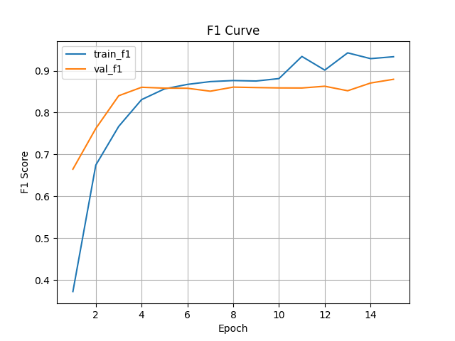
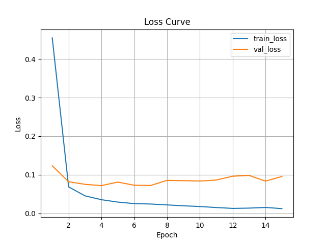

# Named Entity Recognition (NER) - PhoNER_COVID19

Fine-tuning **PhoBERT** for Named Entity Recognition (NER) on the **PhoNER_COVID19** dataset - a Vietnamese NER dataset for medical entities and COVID-19 related text.

## Project Overview

This project fine-tunes **PhoBERT-base-v2** (a pre-trained BERT model for Vietnamese) to recognize named entities in Vietnamese text. The model is trained on the PhoNER_COVID19 dataset from [VinAIResearch](https://github.com/VinAIResearch/PhoNER_COVID19).

## Project Structure

```
NER/
├── main.py                         # Entry point for training and evaluation
├── config.yaml                     # Configuration file for model and training
├── requirements.txt                # Python dependencies
├── README.md                       # This file
│   
├── source/                         # Main source code
│   ├── model.py                    # NER model architecture
│   ├── data_loader.py              # Dataset and DataLoader implementation    
│   ├── trainer.py                  # Training loop and utilities
│   ├── eval.py                     # Evaluation and metrics computation   
│   └── eda.ipynb                   # Exploratory Data Analysis notebook   
│   
├── data/                           # Dataset directory
│   ├── train.jsonl                 # Training dataset
│   ├── validation.jsonl            # Validation dataset
│   ├── test.jsonl                  # Test dataset
│   └── labels.json                 # Label definitions
│   
└── checkpoints/                    # Model checkpoints
    ├── best.pt                     # Best model checkpoint
    ├── epoch_*.pt                  # Epoch-specific checkpoints
    ├── history.json                # Training history
    ├── classification_report.txt   # Evaluation report
    └── eval_per_class.json         # Per-class metrics
```

## Installation

### 1. Clone or download the project

```bash
cd PhobertNER
```

### 2. Create a virtual environment

```bash
# On Windows
python -m venv venv
venv\Scripts\activate

# On macOS/Linux
python -m venv venv
source venv/bin/activate
```

### 3. Install dependencies

```bash
pip install -r requirements.txt
```

## Configuration

Edit `config.yaml` to customize parameters:

### Model Configuration

```yaml
MODEL:
  NAME: "phobert_ner"
  PRETRAINED_NAME: "vinai/phobert-base-v2"
  FREEZE_BERT: true
  UNFREEZE_LAST_N_LAYERS: 1
  
  CLASSIFIER:
    NUM_LAYERS: 2
    HIDDEN_DIM: 256
```

### Data Configuration

```yaml
DATA:
  TRAIN_PATH: "data/train.jsonl"
  VAL_PATH: "data/validation.jsonl"
  TEST_PATH: "data/test.jsonl"
  LABELS_PATH: "data/labels.json"
  
  BATCH_SIZE: 64
  MAX_SEQ_LEN: 196
```

### Training Configuration

```yaml
TRAIN:
  LR: 1e-3
  MAX_EPOCHS: 15
  OPTIMIZER: "adamw"
  CHECKPOINT_DIR: "checkpoints"

WORKERS: 4
```

## Usage

### Training

```bash
python main.py --mode train
```

### Evaluation

```bash
python main.py --mode eval
```

## Training Results

After training, the following outputs are saved to `checkpoints/`:

- **best.pt**: Best model weights
- **history.json**: Training/validation loss and metrics for each epoch
- **classification_report.txt**: Precision, recall, and F1-score
- **eval_per_class.json**: Per-class performance metrics

### Training and Evaluation Metrics

| F1-Score Over Epochs | Loss Over Epochs |
|---|---|
|  |  |

### Evaluation Results

The model achieves **98% overall accuracy** on the test set:

- **Weighted F1-Score**: 0.98
- **Macro-averaged F1-Score**: 0.80
- **Macro-averaged Recall**: 0.78


See `checkpoints/classification_report.txt` and `checkpoints/eval_per_class.json` for detailed per-class metrics.
